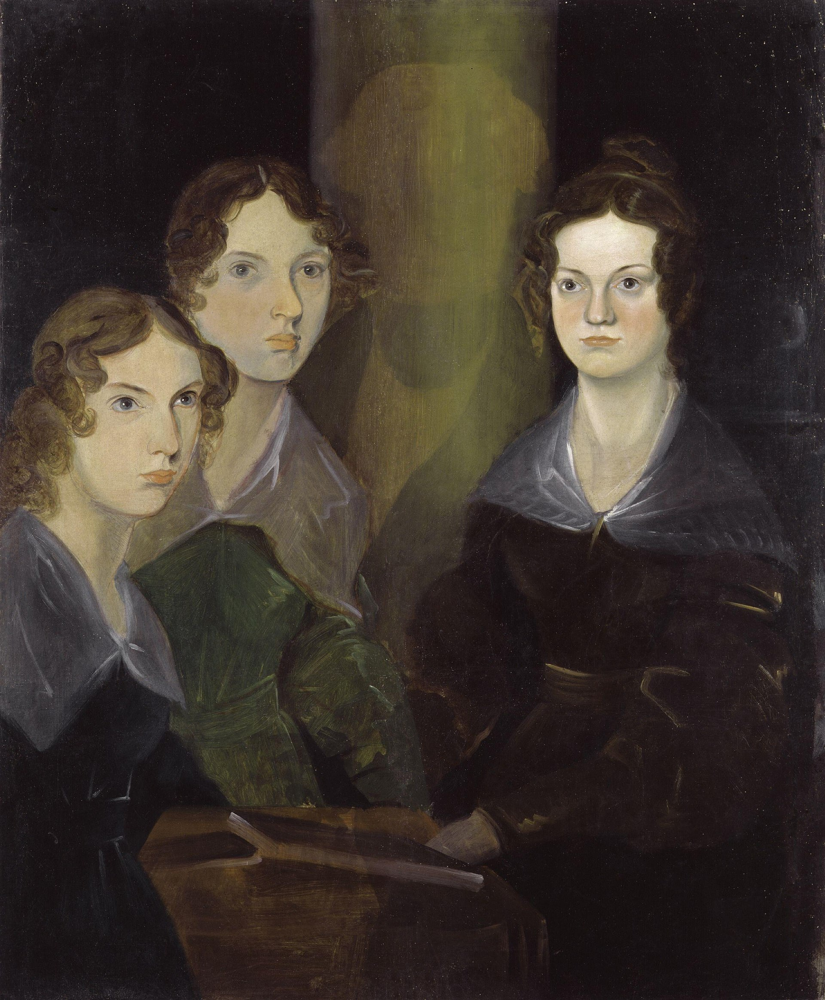

# Brontë
Having fun with text analysis on the Brontë sisters' works

Source: https://www.gutenberg.org/

*source: Wikipedia*

## Works by the Brontë sisters available on Project Gutenberg:

Sister|Title|EBook-No
---|---|---
Anne|The Tenant of Wildfell Hall|969
Anne|Agnes Grey|767
Charlotte|Jane Eyre: An Autobiography|1260
Charlotte| The Professor |1028
Charlotte|Shirley|30486
Charlotte|Villette|9182
Emily|Wuthering Heights|768
